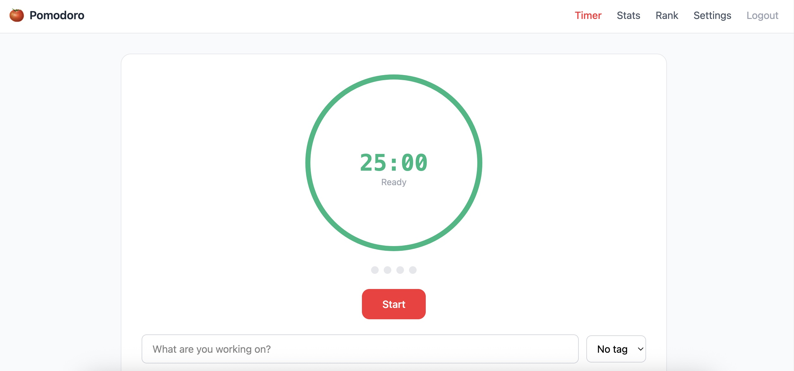

# Pomodoro Timer

一个全栈番茄钟应用，支持实时同步、数据统计和排行榜功能。

基于 **Vue 3** + **Spring Boot** 构建，集成 JWT 认证、WebSocket 实时通信和多维度数据分析。

## 功能特性

- **番茄计时器** — 工作、短休息、长休息，时长可自定义
- **计时控制** — 开始、暂停、继续、重置、跳过；支持自动开始下一轮
- **标签管理** — 彩色分类标签，对专注记录进行归类
- **数据统计** — 按日、周、月查看分析图表，支持 CSV 导出
- **排行榜** — 每日/每周排名，激励持续专注
- **个性化设置** — 自定义工作/休息时长、提示音、每日目标
- **实时同步** — 基于 WebSocket 的计时器状态同步
- **用户认证** — JWT 注册登录，支持令牌自动刷新

## 运行截图



## 技术栈

| 层级 | 技术 |
|------|------|
| 前端 | Vue 3, TypeScript, Vite, Pinia, Tailwind CSS |
| 后端 | Java 17, Spring Boot 3, Spring Security, MyBatis-Plus |
| 数据库 | MySQL 8.0+ |
| 认证 | JWT (access + refresh token) |
| 实时通信 | WebSocket (STOMP over SockJS) |
| 图表 | Chart.js + vue-chartjs |
| 测试 | Vitest (前端), JUnit 5 (后端) |
| 部署 | Docker, Docker Compose, Nginx |

## 项目结构

```
pomodoro-timer/
├── docker-compose.yml    # Docker 编排配置
├── .env.example          # 环境变量示例
├── frontend/
│   ├── Dockerfile        # 前端镜像 (Node 构建 + Nginx 托管)
│   ├── nginx.conf        # Nginx 反向代理与 SPA 路由配置
│   └── src/
│       ├── api/           # Axios 请求封装
│       ├── components/    # Vue 组件 (布局、计时器、通用)
│       ├── composables/   # 组合式函数 (useTimer)
│       ├── router/        # Vue Router 路由与鉴权守卫
│       ├── stores/        # Pinia 状态管理 (auth, timer, settings, tags)
│       ├── types/         # TypeScript 类型定义
│       ├── utils/         # 工具函数
│       └── views/         # 页面组件
├── backend/
│   ├── Dockerfile        # 后端镜像 (Maven 构建 + JRE 运行)
│   └── src/main/java/com/pomodoro/
│       ├── config/        # 安全、WebSocket、CORS、MyBatis+ 配置
│       ├── controller/    # REST 与 WebSocket 接口
│       ├── service/       # 业务逻辑
│       ├── entity/        # 数据库实体
│       ├── mapper/        # MyBatis+ 数据访问
│       ├── dto/           # 请求/响应对象
│       ├── security/      # JWT 过滤器
│       └── common/        # 统一响应封装
```

## 快速开始

### 方式一：Docker Compose（推荐）

只需安装 [Docker](https://docs.docker.com/get-docker/)，一条命令启动所有服务：

```bash
# 复制环境变量示例文件并按需修改
cp .env.example .env

# 构建并启动（MySQL + 后端 + 前端）
docker compose up -d --build
```

启动完成后访问 `http://localhost` 即可使用。

常用命令：

```bash
# 查看服务状态
docker compose ps

# 查看日志（实时跟踪）
docker compose logs -f

# 查看单个服务日志
docker compose logs -f backend

# 停止服务
docker compose down

# 停止并清除数据（包括数据库）
docker compose down -v
```

> **国内网络提示：** 如果拉取 Docker 镜像超时，可在 Docker Desktop 中配置镜像加速器（Settings → Docker Engine），添加 `"registry-mirrors": ["https://dockerpull.org"]`；或配置代理（Settings → Resources → Proxies）。

### 方式二：本地开发

#### 环境要求

- Node.js >= 20.19.0 (或 >= 22.12.0)
- Java 17+
- Maven 3.8+
- MySQL 8.0+

#### 初始化数据库

```bash
mysql -u root -p < backend/src/main/resources/db/schema.sql
```

#### 启动后端

本地开发时需要激活 `local` profile（加载 `application-local.yml` 中的数据库密码和 JWT 密钥）：

```bash
cd backend

# 构建
mvn clean install

# 方式 A：命令行参数激活 local profile
mvn spring-boot:run -Dspring-boot.run.profiles=local

# 方式 B：环境变量激活
export SPRING_PROFILES_ACTIVE=local
mvn spring-boot:run

# 方式 C：在 IntelliJ / VS Code 的运行配置中设置 Active Profiles = local
```

如果不使用 `local` profile，也可以直接设置环境变量：

```bash
export DB_URL=jdbc:mysql://localhost:3306/pomodoro?useUnicode=true&characterEncoding=utf-8&serverTimezone=UTC&allowPublicKeyRetrieval=true&useSSL=false
export DB_USERNAME=root
export DB_PASSWORD=your_password
export JWT_SECRET=your_jwt_secret_key_at_least_256_bits
export CORS_ALLOWED_ORIGINS=http://localhost:5173
mvn spring-boot:run
```

后端服务运行在 `http://localhost:10010`。

#### 启动前端

```bash
cd frontend

# 安装依赖
npm install

# 启动开发服务器
npm run dev
```

前端运行在 `http://localhost:5173`，API 请求自动代理到后端。

#### 生产构建

```bash
cd frontend
npm run build
```

## API 概览

| 模块 | 接口 |
|------|------|
| 认证 | `POST /api/auth/register`, `POST /api/auth/login`, `POST /api/auth/refresh`, `GET /api/auth/me` |
| 番茄钟 | `POST /api/pomodoros/start`, `PUT /api/pomodoros/{id}/complete`, `PUT /api/pomodoros/{id}/interrupt`, `GET /api/pomodoros/today` |
| 统计 | `GET /api/stats/daily`, `GET /api/stats/weekly`, `GET /api/stats/monthly`, `GET /api/stats/overview`, `GET /api/stats/export` |
| 排行榜 | `GET /api/leaderboard/daily`, `GET /api/leaderboard/weekly` |
| 标签 | `GET /api/tags`, `POST /api/tags`, `PUT /api/tags/{id}`, `DELETE /api/tags/{id}` |
| 设置 | `GET /api/settings`, `PUT /api/settings` |
| WebSocket | `WS /ws/timer` → 订阅 `/topic/timer/{userId}` |

## 运行测试

```bash
# 前端单元测试
cd frontend && npm run test:unit

# 后端测试
cd backend && mvn test
```

## 环境变量

### Docker Compose（`.env` 文件）

| 变量 | 说明 | 默认值 |
|------|------|--------|
| `MYSQL_ROOT_PASSWORD` | MySQL root 密码 | `pomodoro123` |
| `JWT_SECRET` | JWT 签名密钥 (至少 256 位) | 内置开发用默认值 |

### 本地开发

| 变量 | 说明 | 默认值 |
|------|------|--------|
| `DB_URL` | MySQL JDBC 连接地址 | — |
| `DB_USERNAME` | 数据库用户名 | — |
| `DB_PASSWORD` | 数据库密码 | — |
| `JWT_SECRET` | JWT 签名密钥 (至少 256 位) | — |
| `CORS_ALLOWED_ORIGINS` | 允许的跨域来源 | `http://localhost:5173` |

## 常见问题

### MySQL 8.0 连接认证失败

MySQL 8.0 默认使用 `caching_sha2_password` 认证插件，在非 SSL 环境下 JDBC 需要额外参数：

```
allowPublicKeyRetrieval=true&useSSL=false
```

项目的 `application.yml` 和 `docker-compose.yml` 已包含这些参数。如果你使用自定义 `DB_URL`，请确保也添加这两个参数。

### Docker 镜像拉取超时

国内网络可能无法直接拉取 Docker Hub 镜像。解决方案：

1. **配置镜像加速器**：Docker Desktop → Settings → Docker Engine，添加：
   ```json
   { "registry-mirrors": ["https://dockerpull.org"] }
   ```
2. **配置代理**：Docker Desktop → Settings → Resources → Proxies

## 许可证

MIT
